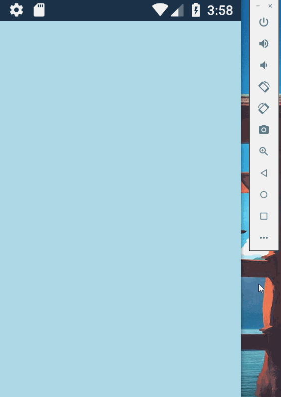

# FragmentStackNavigationController

A navigation controller for transitioning between fragments via push and pop operations in Xamarin.Android.

**The example project used to create this flow is included.**

## Usage

Add FragmentStackNavigationController.cs to your project and add an instance of it to your SupportFragmentManager or ChildFragmentManager. Then push and pop fragments onto and off of it.

`public static FragmentStackNavigationController Create(int pushEnterAnimation, int pushExitAnimation, int popEnterAnimation, int popExitAnimation)`

Create an instance of FragmentStackNavigationController that uses the provided animations to transition between fragments. The example project has some animations you can use in ExampleProject/App1/Resources/anim.

`public IEnumerable<Fragment> Fragments { get; }`

Get the fragments that are currently on the stack (the bottom of the stack is at index 0).

`public void Push(Fragment fragment)`

Push a fragment onto the stack.

`public bool Pop()`

Pop a fragment off of the stack, if there's more than one fragment on the stack. The root fragment cannot be popped. Returns true if a fragment was popped, false if not.
